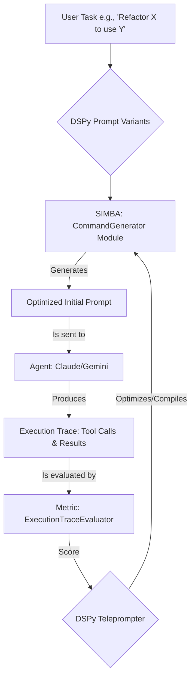

Of course. Based on the concepts in the DSPy documentation, I can outline an architecture for what you're calling "SIMBA."

This architecture will use DSPy's core principles (Signatures, Modules, Teleprompters, and Metrics) to meta-optimize the generation of initial prompts or high-level plans for a code-generation agent like Claude or Gemini. The goal is to produce an initial command that leads to the most efficient and successful tool-use trace.

Here is the proposed SIMBA architecture.

### SIMBA: A DSPy-based Meta-Optimization Architecture for Agentic Workflows

The core concept is that we are not optimizing the agent's tool-use commands directly. Instead, we are using DSPy to optimize a **Command Generator** module. The "goodness" of this generator is measured by the quality of the execution trace produced by the agent that consumes its output.

---

### Architectural Components

#### 1. The Metric: `ExecutionTraceEvaluator`

This is the most critical component. It defines what a "good" execution looks like. The metric function will take a generated execution trace and score it. A score could be a float between 0.0 (total failure) and 1.0 (perfect execution).

The criteria for a good trace include:
*   **Task Success:** Did the final outcome achieve the user's goal? (e.g., tests pass, the feature is implemented). This is the primary signal.
*   **Efficiency:**
    *   **Step Count:** Fewer tool calls are generally better.
    *   **Error/Correction Loops:** Penalize traces with errors, retries, and dead ends.
    *   **Token Count:** A lower token count for the whole interaction could be a secondary goal.
*   **Tool Correctness:** Did the agent use the best possible tool for the job? Did it avoid deprecated or less efficient commands?

**Implementation:** A Python function that parses the trace.

```python
def execution_trace_metric(gold_standard_trace: str, predicted_trace: str, task_description: str) -> float:
    """
    Scores the predicted_trace.
    - Returns 1.0 if the task is successfully completed with high efficiency.
    - Returns values closer to 0.0 for failures or inefficient traces.
    - The gold_standard_trace might not be a perfect trace, but a reference.
    """
    # Heuristics to calculate the score
    success = check_task_success(predicted_trace, task_description) # e.g., run a verification script
    if not success:
        return 0.0

    efficiency_score = 1.0
    # Penalize based on number of steps
    efficiency_score -= 0.1 * count_tool_calls(predicted_trace)
    # Penalize for errors
    efficiency_score -= 0.2 * count_errors(predicted_trace)

    return max(0.1, efficiency_score) # Return a small score even for success if inefficient
```

#### 2. The Signature: `TaskToCommandSignature`

This signature defines the input/output for our module. It takes a high-level task and prompt variations and should output an optimized initial prompt for the agent.

```python
class TaskToCommandSignature(dspy.Signature):
    """
    Generates an optimized, high-level initial prompt for a coding agent
    based on a task description and examples of how it could be phrased.
    """
    task_description = dspy.InputField(desc="The user's high-level objective.")
    prompt_variants = dspy.InputField(desc="A list of different ways to ask for the same task.")
    
    optimized_initial_prompt = dspy.OutputField(desc="A clear, high-level, multi-step prompt for an agent to execute the task efficiently.")
```

#### 3. The Module: `CommandGenerator`

This is the DSPy module that we will compile and optimize. It uses our signature to generate the initial prompt. Internally, it could be a `dspy.ChainOfThought` or a more complex custom module.

```python
class CommandGenerator(dspy.Module):
    def __init__(self):
        super().__init__()
        self.generator = dspy.ChainOfThought(TaskToCommandSignature)

    def forward(self, task_description, prompt_variants):
        return self.generator(task_description=task_description, prompt_variants=prompt_variants)
```

#### 4. The Agent Simulation: `ToolUserAgent`

To make this work within DSPy's framework, we need a way to simulate the agent's execution to get the trace. This would be a wrapper around the actual agent (Claude, Gemini, etc.).

**Implementation:** A function that takes the `optimized_initial_prompt` and returns the full execution trace.

```python
def get_agent_execution_trace(initial_prompt: str) -> str:
    """
    This function sends the prompt to the agent (e.g., via API)
    and captures the entire subsequent interaction (tool calls, outputs, errors)
    as a single string. This string is the execution trace.
    """
    # In a real scenario, this would involve:
    # 1. Connecting to the agent API.
    # 2. Sending the initial_prompt.
    # 3. Looping to receive and process tool calls until the task is done.
    # 4. Recording every step into a log.
    trace = f"Trace for prompt: {initial_prompt}\n"
    # ... execute and record ...
    return trace
```

#### 5. The Teleprompter & Compilation Loop

This is where everything comes together. We use a DSPy teleprompter, like `BootstrapFewShot`, to optimize our `CommandGenerator`. The teleprompter will use our `execution_trace_metric` to evaluate different generated prompts.

The optimization process works like this:
1.  The teleprompter gives the `CommandGenerator` a `task_description`.
2.  The `CommandGenerator` produces an `optimized_initial_prompt`.
3.  This prompt is passed to our `get_agent_execution_trace` function, which returns the agent's tool-use trace.
4.  The `execution_trace_metric` scores this trace.
5.  The teleprompter uses this score as feedback. It will try different demonstrations and prompt strategies for the `CommandGenerator` to maximize the metric's score.

---

### Workflow Diagram



### Action Plan

To implement this, I will create a new markdown file, `simba_architecture.md`, detailing this design. This will serve as the foundational document for building the SIMBA optimization system.

I will now create the `simba_architecture.md` file.My apologies. The file path must be absolute. I will correct it now.I have created the `simba_architecture.md` file with the detailed architecture. You can review it to see the complete plan for implementing the SIMBA optimization system.
